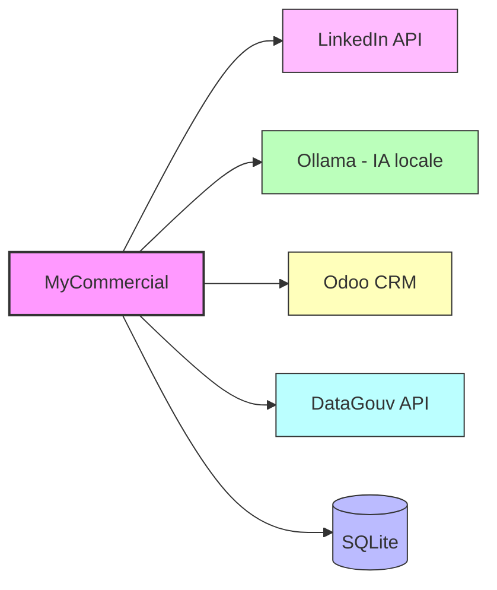
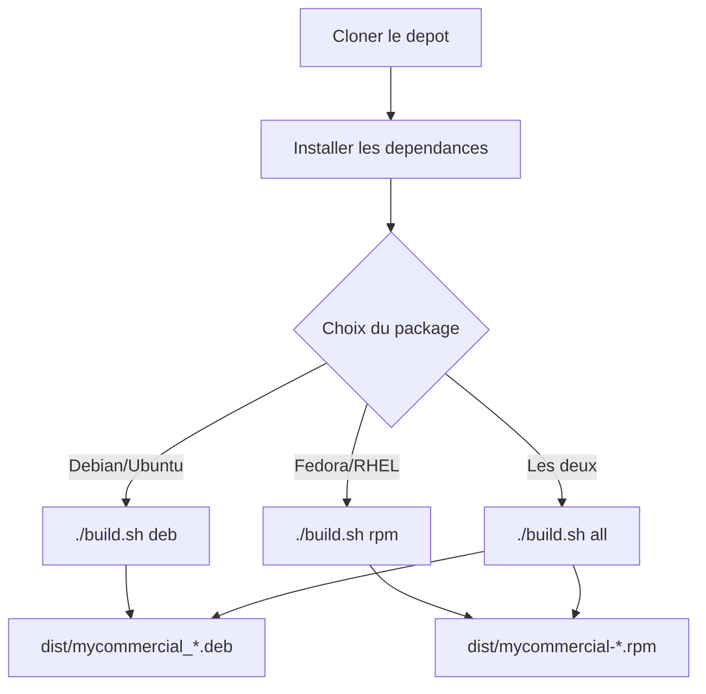
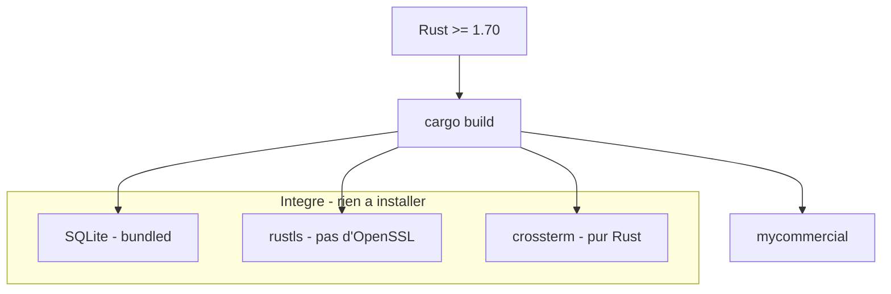
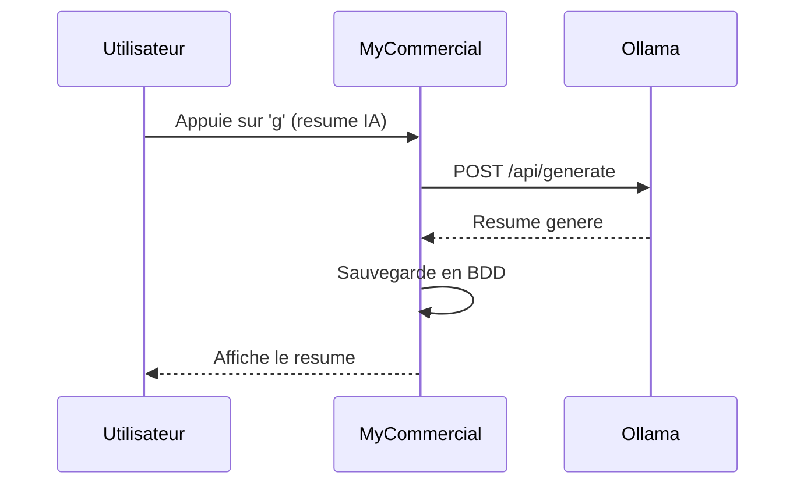
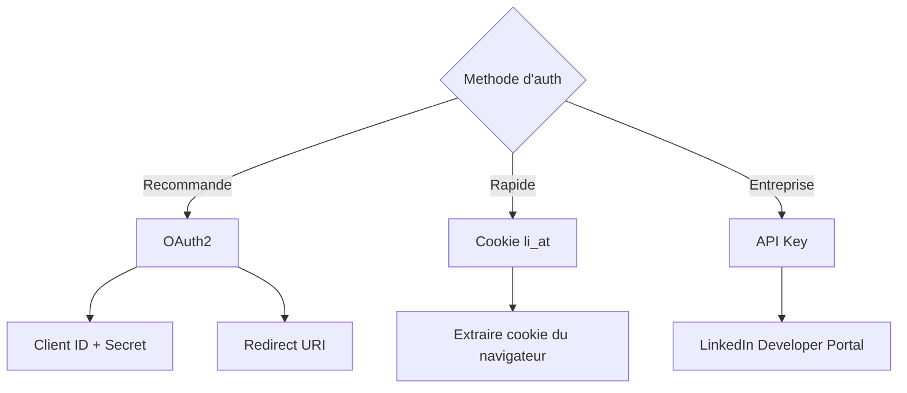

# MyCommercial - Guide d'Installation

## Table des matieres

- [Prerequis](#prerequis)
- [Installation rapide](#installation-rapide)
- [Installation depuis les packages](#installation-depuis-les-packages)
- [Installation depuis les sources](#installation-depuis-les-sources)
- [Configuration initiale](#configuration-initiale)
- [Services externes](#services-externes)
- [Desinstallation](#desinstallation)
- [Depannage](#depannage)

---

## Prerequis

### Systeme

| Composant | Minimum | Recommande |
|-----------|---------|------------|
| OS | Linux (x86_64) | Ubuntu 22.04+ / Fedora 38+ / Rocky 9+ |
| RAM | 256 Mo | 512 Mo |
| Disque | 50 Mo | 200 Mo (avec cache entreprises) |
| Terminal | 80x24 | 120x40 (pour un affichage optimal) |

### Services optionnels



| Service | Obligatoire | Description |
|---------|-------------|-------------|
| SQLite | Oui (integre) | Base de donnees embarquee, aucune installation |
| Ollama | Non | IA locale pour resumer et generer des messages |
| LinkedIn | Non | Recherche de contacts et envoi de messages |
| Odoo | Non | Suivi CRM des leads |
| DataGouv API | Non | Recherche d'entreprises (API ouverte, sans cle) |

---

## Installation rapide

### Via le package .deb (Debian/Ubuntu)

```bash
# Telecharger le package
wget https://github.com/cve-solutions/MyCommercial/releases/latest/download/mycommercial_0.1.0-1_amd64.deb

# Installer
sudo dpkg -i mycommercial_0.1.0-1_amd64.deb

# Lancer
mycommercial
```

### Via le package .rpm (Fedora/RHEL/Rocky)

```bash
# Telecharger le package
wget https://github.com/cve-solutions/MyCommercial/releases/latest/download/mycommercial-0.1.0-1.x86_64.rpm

# Installer
sudo dnf install ./mycommercial-0.1.0-1.x86_64.rpm

# Lancer
mycommercial
```

---

## Installation depuis les packages

### Generer les packages soi-meme



```bash
# 1. Cloner le depot
git clone https://github.com/cve-solutions/MyCommercial.git
cd MyCommercial

# 2. Installer les outils de packaging
./build.sh install-deps

# 3. Generer les packages
./build.sh all

# 4. Les packages sont dans dist/
ls -lh dist/
```

### Commandes build.sh

| Commande | Description |
|----------|-------------|
| `./build.sh build` | Compiler le binaire release uniquement |
| `./build.sh deb` | Compiler + generer .deb |
| `./build.sh rpm` | Compiler + generer .rpm |
| `./build.sh all` | Compiler + .deb + .rpm |
| `./build.sh install-deps` | Installer cargo-deb et cargo-generate-rpm |
| `./build.sh clean` | Nettoyer les artefacts |

---

## Installation depuis les sources

### 1. Installer Rust

```bash
curl --proto '=https' --tlsv1.2 -sSf https://sh.rustup.rs | sh
source $HOME/.cargo/env
```

### 2. Cloner et compiler

```bash
git clone https://github.com/cve-solutions/MyCommercial.git
cd MyCommercial
cargo build --release
```

### 3. Installer le binaire

```bash
# Option A : copier dans /usr/local/bin
sudo cp target/release/mycommercial /usr/local/bin/

# Option B : lancer directement
./target/release/mycommercial
```

### Dependances de compilation



Aucune bibliotheque systeme n'est requise grace a :
- **rusqlite** avec `bundled` : SQLite compile statiquement
- **reqwest** avec `rustls-tls` : pas besoin d'OpenSSL
- **crossterm** / **ratatui** : pur Rust

---

## Configuration initiale

### Emplacement des donnees

```
~/.local/share/mycommercial/
    mycommercial.db     # Base SQLite (settings, contacts, messages...)
    mycommercial.log    # Fichier de log
```

### Premier lancement

Au premier lancement, MyCommercial cree automatiquement :
1. La base de donnees SQLite
2. Les tables necessaires
3. Les settings par defaut

```bash
mycommercial
```

L'application s'ouvre sur le **Dashboard**. Allez dans l'onglet **Settings** (touche `7`) pour configurer les services.

---

## Services externes

### Ollama (IA locale)



#### Installation d'Ollama

```bash
# Linux
curl -fsSL https://ollama.com/install.sh | sh

# Demarrer le service
ollama serve

# Installer un modele (recommande)
ollama pull mistral
# ou
ollama pull llama3.1
```

#### Configuration dans MyCommercial

1. Onglet **Settings** > categorie **ollama**
2. Verifier `base_url` = `http://localhost:11434`
3. Appuyer sur `t` pour tester la connexion
4. Appuyer sur `a` pour auto-selectionner le meilleur modele

### LinkedIn

#### Methodes d'authentification



| Methode | Configuration requise | Difficulte |
|---------|----------------------|------------|
| OAuth2 | `client_id`, `client_secret`, `redirect_uri` | Moyenne |
| Cookie (li_at) | `cookie_li_at` | Facile |
| API Key | `api_key` | Facile |

#### Configuration OAuth2

1. Creer une app sur [LinkedIn Developer Portal](https://www.linkedin.com/developers/)
2. Onglet **Settings** > categorie **linkedin**
3. Renseigner `client_id`, `client_secret`, `redirect_uri`
4. Changer `auth_method` en `oauth2`

#### Configuration Cookie

1. Se connecter a LinkedIn dans le navigateur
2. Ouvrir les DevTools > Application > Cookies
3. Copier la valeur du cookie `li_at`
4. Onglet **Settings** > categorie **linkedin** > `cookie_li_at`
5. Changer `auth_method` en `cookie`

### Odoo CRM

```bash
# Configuration dans Settings > odoo
enabled    = true
url        = https://votre-instance.odoo.com
database   = nom_de_la_base
username   = votre_email
password   = votre_mot_de_passe  # ou API key
```

### API DataGouv (Recherche Entreprises)

L'API de recherche d'entreprises est **ouverte et gratuite** (pas de cle necessaire).

Pour l'API Sirene INSEE (optionnelle, plus detaillee) :
1. Creer un compte sur [api.insee.fr](https://api.insee.fr/)
2. Souscrire a l'API Sirene
3. Onglet **Settings** > categorie **datagouv** > `sirene_api_token`

---

## Desinstallation

### Package .deb

```bash
sudo dpkg -r mycommercial
```

### Package .rpm

```bash
sudo dnf remove mycommercial
```

### Donnees utilisateur

```bash
# Supprimer la base de donnees et les logs
rm -rf ~/.local/share/mycommercial/
```

---

## Depannage

### L'application ne se lance pas

```bash
# Verifier les logs
cat ~/.local/share/mycommercial/mycommercial.log

# Lancer avec plus de logs
RUST_LOG=debug mycommercial
```

### L'affichage est casse

```bash
# Verifier la taille du terminal
echo "Colonnes: $(tput cols) Lignes: $(tput lines)"
# Minimum recommande : 80x24

# Verifier le support Unicode
echo "Test Unicode: ━━━ ● ✓ ✗"
```

### Ollama ne repond pas

```bash
# Verifier qu'Ollama tourne
curl http://localhost:11434/api/tags

# Redemarrer
ollama serve
```

### Erreur SQLite

```bash
# Verifier les permissions
ls -la ~/.local/share/mycommercial/

# Reset complet (perte des donnees!)
rm ~/.local/share/mycommercial/mycommercial.db
```

### Le package .deb ne s'installe pas

```bash
# Installer les dependances manquantes
sudo apt-get install -f

# Verifier l'architecture
dpkg --print-architecture  # doit etre amd64
```
