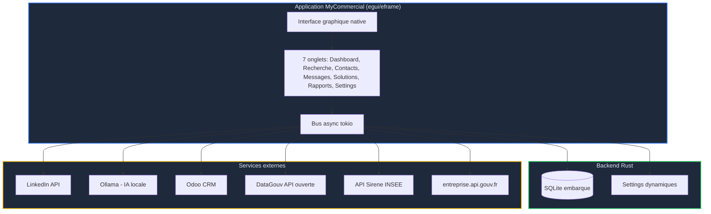
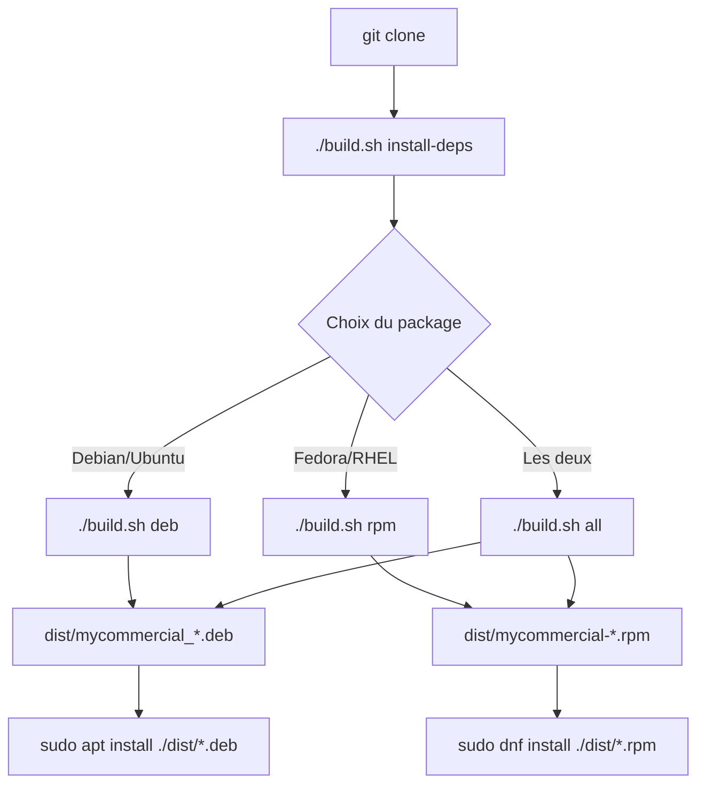
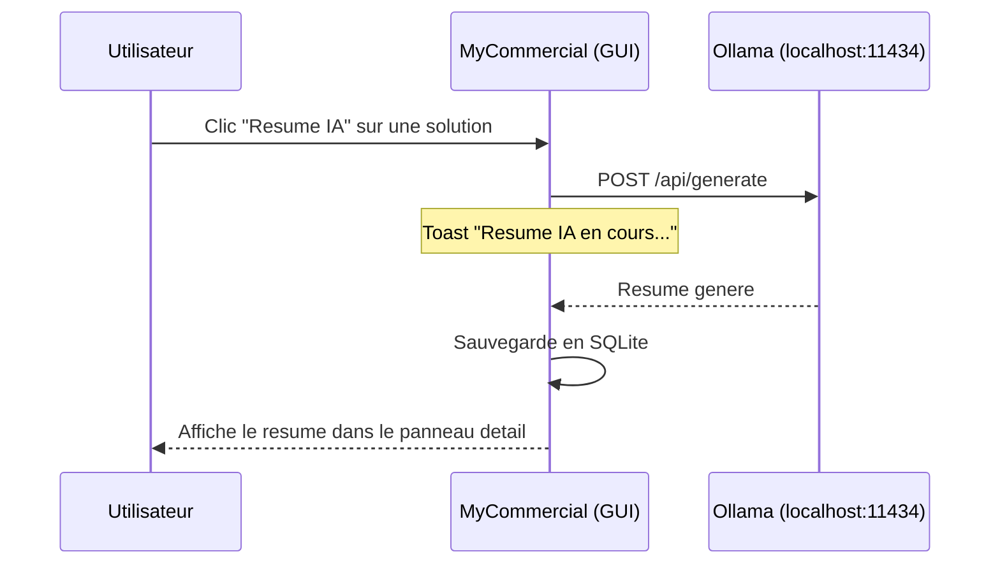
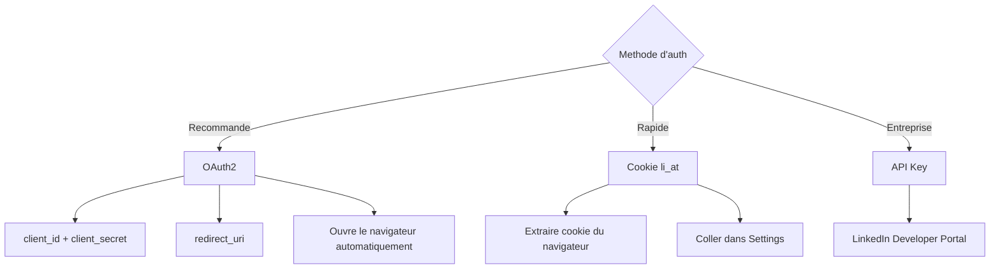

# MyCommercial - Guide d'Installation

## Table des matieres

- [Prerequis](#prerequis)
- [Installation rapide](#installation-rapide)
- [Installation depuis les packages](#installation-depuis-les-packages)
- [Installation depuis les sources](#installation-depuis-les-sources)
- [Configuration initiale](#configuration-initiale)
- [Services externes](#services-externes)
- [Desinstallation](#desinstallation)
- [Depannage](#depannage)

---

## Prerequis

### Systeme

| Composant | Minimum | Recommande |
|-----------|---------|------------|
| OS | Linux x86_64 | Ubuntu 22.04+ / Fedora 38+ / Rocky 9+ |
| Affichage | X11 ou Wayland | Wayland + GPU accelere |
| RAM | 512 Mo | 1 Go |
| Disque | 100 Mo | 500 Mo (avec cache entreprises) |
| Resolution | 900x600 | 1280x800 ou plus |

### Architecture



### Dependances systeme (GUI native)

L'application utilise **egui/eframe** avec OpenGL. Les bibliotheques graphiques suivantes sont requises :

#### Debian / Ubuntu

```bash
# Compilation
sudo apt-get install build-essential pkg-config \
    libxcb-render0-dev libxcb-shape0-dev libxcb-xfixes0-dev \
    libxkbcommon-dev libfontconfig1-dev libfreetype-dev \
    libgl-dev libegl-dev libwayland-dev libxcb1-dev

# Runtime
sudo apt-get install libgl1 libegl1 libfontconfig1 \
    libxcb-render0 libxcb-shape0 libxcb-xfixes0 libxkbcommon0
```

#### Fedora / RHEL / Rocky

```bash
# Compilation + Runtime
sudo dnf install gcc make pkgconfig \
    libxcb-devel libxkbcommon-devel fontconfig-devel freetype-devel \
    mesa-libGL-devel mesa-libEGL-devel wayland-devel
```

> **Raccourci :** `./build.sh install-deps` installe tout automatiquement.

### Services optionnels

| Service | Obligatoire | Description |
|---------|-------------|-------------|
| SQLite | Oui (integre) | Base de donnees embarquee, aucune installation |
| Ollama | Non | IA locale pour resumer et generer des messages |
| LinkedIn | Non | Recherche de contacts et envoi de messages |
| Odoo | Non | Suivi CRM des leads |
| DataGouv API | Non | Recherche d'entreprises (API ouverte, sans cle) |

---

## Installation rapide

### Via le package .deb (Debian/Ubuntu)

```bash
# Telecharger le package (inclut les dependances dans les metadonnees)
wget https://github.com/cve-solutions/MyCommercial/releases/latest/download/mycommercial_0.2.0-1_amd64.deb

# Installer (resout les dependances automatiquement)
sudo apt install ./mycommercial_0.2.0-1_amd64.deb

# Lancer
mycommercial
```

### Via le package .rpm (Fedora/RHEL/Rocky)

```bash
# Telecharger
wget https://github.com/cve-solutions/MyCommercial/releases/latest/download/mycommercial-0.2.0-1.x86_64.rpm

# Installer (resout les dependances automatiquement)
sudo dnf install ./mycommercial-0.2.0-1.x86_64.rpm

# Lancer
mycommercial
```

---

## Installation depuis les packages

### Generer les packages soi-meme



```bash
# 1. Cloner
git clone https://github.com/cve-solutions/MyCommercial.git
cd MyCommercial

# 2. Installer toutes les dependances (systeme + outils packaging)
./build.sh install-deps

# 3. Generer les packages
./build.sh all

# 4. Installer
sudo apt install ./dist/mycommercial_*.deb     # Debian/Ubuntu
# ou
sudo dnf install ./dist/mycommercial-*.rpm      # Fedora/RHEL
```

### Commandes build.sh

| Commande | Description |
|----------|-------------|
| `./build.sh build` | Compiler le binaire release uniquement |
| `./build.sh deb` | Compiler + generer .deb |
| `./build.sh rpm` | Compiler + generer .rpm |
| `./build.sh all` | Compiler + .deb + .rpm |
| `./build.sh install-deps` | Installer dependances systeme + outils packaging |
| `./build.sh check-deps` | Verifier les dependances systeme |
| `./build.sh clean` | Nettoyer les artefacts |

---

## Installation depuis les sources

### 1. Installer Rust

```bash
curl --proto '=https' --tlsv1.2 -sSf https://sh.rustup.rs | sh
source $HOME/.cargo/env
```

### 2. Installer les dependances systeme

```bash
# Debian/Ubuntu
sudo apt-get install build-essential pkg-config \
    libxcb-render0-dev libxcb-shape0-dev libxcb-xfixes0-dev \
    libxkbcommon-dev libfontconfig1-dev libfreetype-dev \
    libgl-dev libegl-dev libwayland-dev libxcb1-dev

# Fedora/RHEL
sudo dnf install gcc make pkgconfig \
    libxcb-devel libxkbcommon-devel fontconfig-devel freetype-devel \
    mesa-libGL-devel mesa-libEGL-devel wayland-devel
```

### 3. Compiler et lancer

```bash
git clone https://github.com/cve-solutions/MyCommercial.git
cd MyCommercial
cargo build --release
./target/release/mycommercial
```

---

## Configuration initiale

### Emplacement des donnees

```
~/.local/share/mycommercial/
    mycommercial.db     # Base SQLite (settings, contacts, messages...)
    mycommercial.log    # Fichier de log
```

### Premier lancement

Au premier lancement, MyCommercial :
1. Ouvre une fenetre native 1280x800 avec theme sombre
2. Cree automatiquement la base SQLite et les tables
3. Initialise les settings par defaut

Allez dans l'onglet **Settings** pour configurer les services externes.

---

## Services externes

### Ollama (IA locale)



#### Installation d'Ollama

```bash
curl -fsSL https://ollama.com/install.sh | sh
ollama serve
ollama pull mistral     # ou llama3.1, gemma, etc.
```

#### Configuration dans MyCommercial

1. Onglet **Settings** > categorie **ollama**
2. Verifier `base_url` = `http://localhost:11434`
3. Cliquer **Tester connexion** dans le panneau lateral
4. Cliquer **Auto-selection modele** pour choisir le meilleur modele installe

### LinkedIn

#### Methodes d'authentification



| Methode | Configuration | Difficulte |
|---------|--------------|------------|
| **OAuth2** | `client_id`, `client_secret`, `redirect_uri` | Moyenne |
| **Cookie** | `cookie_li_at` | Facile |
| **API Key** | `api_key` | Facile |

Configuration dans **Settings > linkedin**.

### Odoo CRM

Settings > **odoo** :
- `enabled` = `true`
- `url` = `https://votre-instance.odoo.com`
- `database`, `username`, `password`

### API DataGouv (Recherche Entreprises)

L'API de recherche d'entreprises est **ouverte et gratuite** - aucune cle necessaire.

Pour l'API Sirene INSEE (optionnelle) : inscription sur [api.insee.fr](https://api.insee.fr/) puis token dans Settings > **datagouv** > `sirene_api_token`.

---

## Desinstallation

```bash
# Debian/Ubuntu
sudo apt remove mycommercial

# Fedora/RHEL
sudo dnf remove mycommercial

# Donnees utilisateur
rm -rf ~/.local/share/mycommercial/
```

---

## Depannage

### L'application ne se lance pas (erreur graphique)

```bash
# Verifier les bibliotheques OpenGL
glxinfo | head -5
# Si manquant :
sudo apt install mesa-utils libgl1    # Debian
sudo dnf install mesa-dri-drivers     # Fedora

# Forcer le backend X11 (si probleme Wayland)
WINIT_UNIX_BACKEND=x11 mycommercial

# Forcer le backend Wayland
WINIT_UNIX_BACKEND=wayland mycommercial
```

### Ecran noir ou freeze

```bash
# Desactiver l'acceleration GPU
LIBGL_ALWAYS_SOFTWARE=1 mycommercial
```

### Verifier les logs

```bash
cat ~/.local/share/mycommercial/mycommercial.log
RUST_LOG=debug mycommercial
```

### Ollama ne repond pas

```bash
curl http://localhost:11434/api/tags    # doit retourner du JSON
ollama serve                            # redemarrer si besoin
```

### Verifier les dependances

```bash
./build.sh check-deps
# ou manuellement :
ldd target/release/mycommercial | grep "not found"
```
