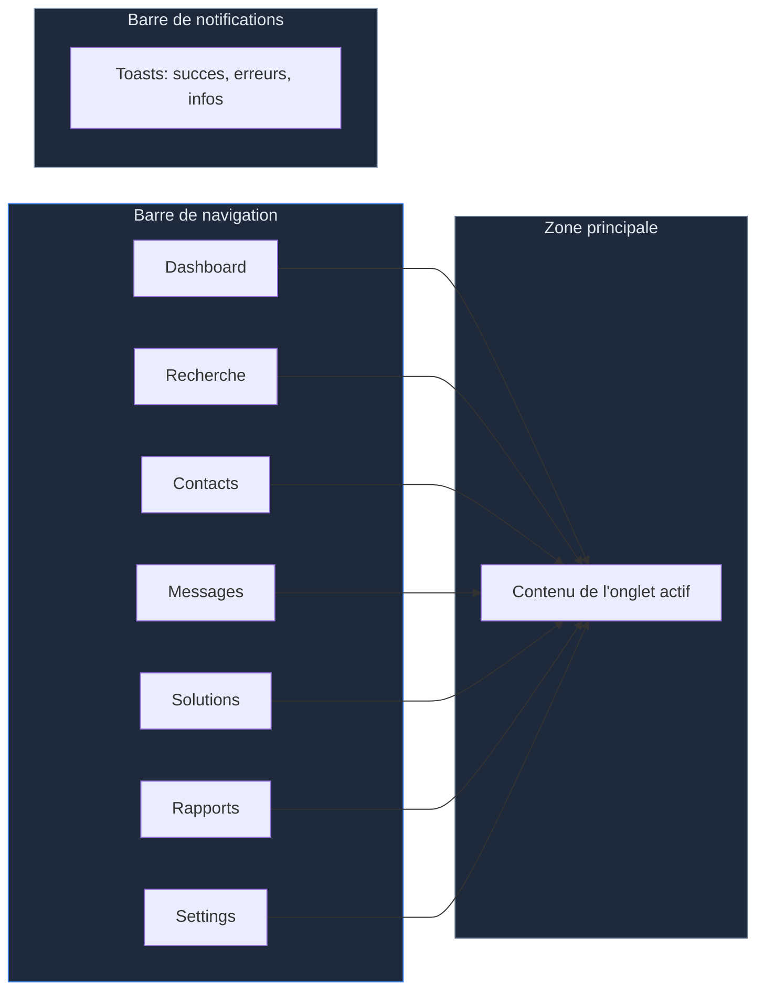
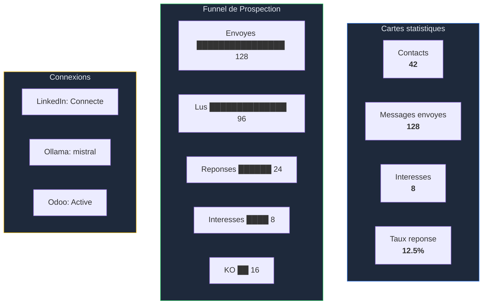
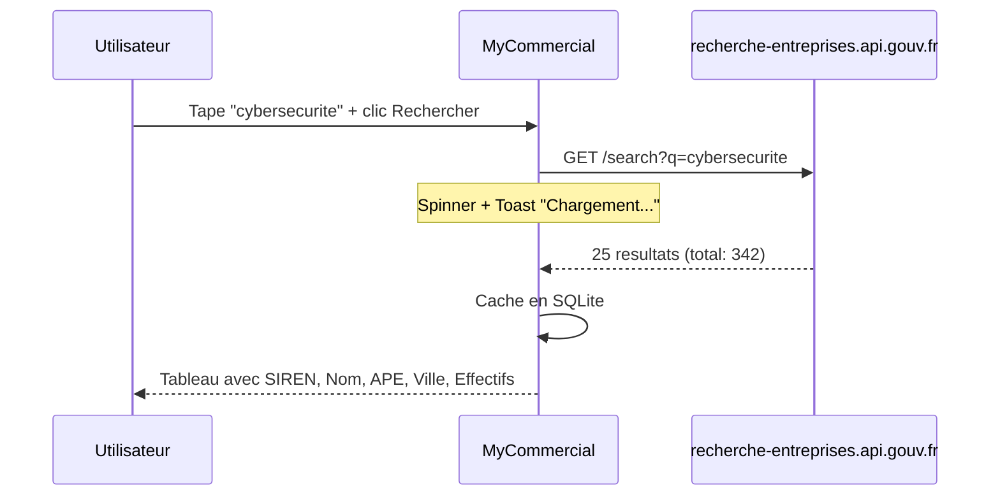
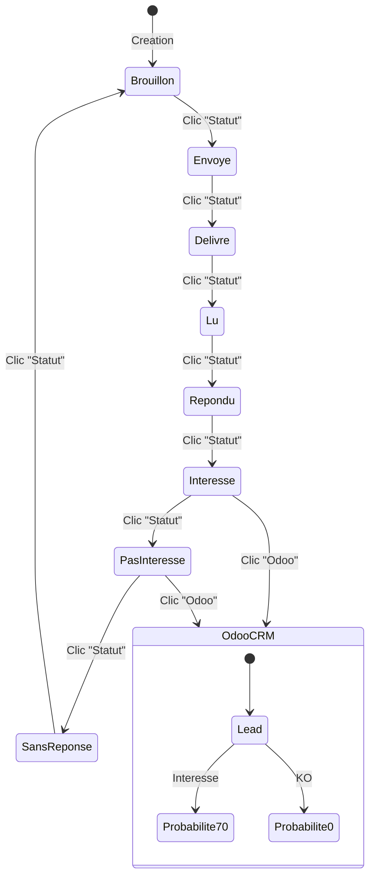
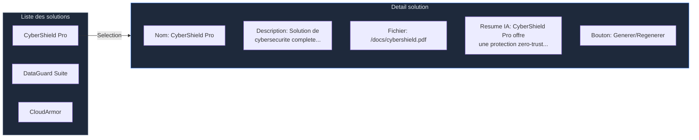
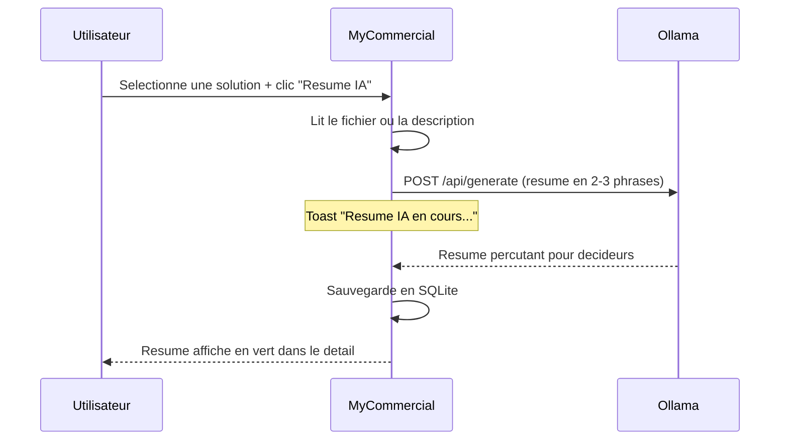
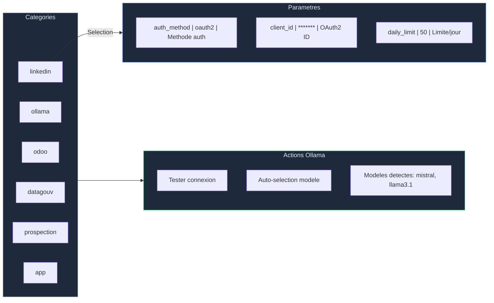
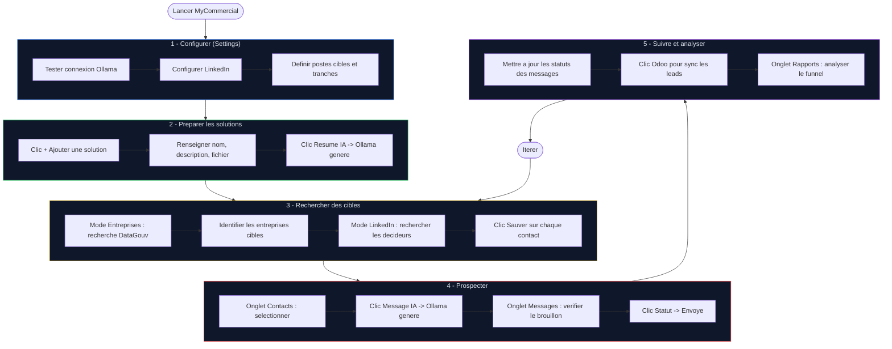

# MyCommercial - Guide d'Utilisation

## Table des matieres

- [Demarrage](#demarrage)
- [Interface generale](#interface-generale)
- [Dashboard](#1-dashboard)
- [Recherche](#2-recherche)
- [Contacts](#3-contacts)
- [Messages](#4-messages)
- [Solutions](#5-solutions)
- [Rapports](#6-rapports)
- [Settings](#7-settings)
- [Workflow complet](#workflow-complet)

---

## Demarrage

```bash
mycommercial
```

Une fenetre native s'ouvre (1280x800, theme sombre) avec 7 onglets.

---

## Interface generale



### Elements de l'interface

| Element | Description |
|---------|-------------|
| **Barre de navigation** | Onglets cliquables en haut, spinner si chargement async |
| **Zone principale** | Contenu adaptatif selon l'onglet (tableaux, formulaires, graphiques) |
| **Toasts** | Notifications temporaires (4s) en bas : succes (vert), erreur (rouge), info (cyan) |
| **Modales** | Fenetres d'erreur et d'edition centrees avec fond assombri |

### Theme couleurs

| Couleur | Usage |
|---------|-------|
| Bleu (#3b82f6) | Elements principaux, liens, boutons primaires |
| Vert (#22c55e) | Succes, statut "Interesse", connexions actives |
| Jaune (#eab308) | Avertissements, statut "Repondu", KPIs importants |
| Rouge (#ef4444) | Erreurs, statut "KO", deconnecte |
| Cyan (#06b6d4) | Information, statut "Lu", valeurs settings |
| Gris (#94a3b8) | Texte secondaire, elements inactifs |

---

## 1. Dashboard

Vue d'ensemble de l'activite de prospection.

### Elements affiches



- **4 cartes KPI** : contacts, messages, interesses, taux de reponse
- **Funnel** : barres de progression colorees (envoyes → lus → reponses → OK/KO)
- **Statut connexions** : badges vert/rouge pour LinkedIn, Ollama, Odoo
- **Bouton Rafraichir** : recharge toutes les stats depuis la BDD

---

## 2. Recherche

Recherche d'entreprises et de contacts avec 2 modes.

### Mode Entreprises (API ouverte)



1. Taper un mot-cle dans la barre de recherche
2. Selectionner le mode **Entreprises** (bouton toggle)
3. Cliquer **Rechercher** ou appuyer sur Entree
4. Les resultats s'affichent dans un tableau triable et redimensionnable

**Colonnes :** SIREN | Nom | Code APE | Libelle APE | Ville | Effectifs

### Mode LinkedIn

1. Selectionner le mode **LinkedIn** (bouton toggle)
2. Taper un mot-cle, cliquer Rechercher
3. Les contacts s'affichent avec un bouton **Sauver** par ligne
4. Cliquer **Sauver** enregistre le contact en base

**Colonnes :** Prenom | Nom | Poste | Entreprise | [Sauver]

---

## 3. Contacts

Liste de tous les contacts sauvegardes.

### Actions par contact

```mermaid
flowchart LR
    C[Contact selectionne] -->|Clic "Message IA"| G[Ollama genere un message]
    G --> B[Brouillon sauvegarde]
    B --> MSG[Visible dans onglet Messages]

    C -->|Clic "Suppr"| D[Contact supprime]
```

| Bouton | Action |
|--------|--------|
| **Message IA** | Genere un message de prospection personnalise via Ollama |
| **Suppr** | Supprime le contact et ses messages associes |
| **Rafraichir** | Recharge la liste depuis la BDD |
| **Page precedente / suivante** | Pagination par 100 contacts |

**Colonnes :** Prenom | Nom | Poste | Entreprise | LinkedIn (coche) | Actions

---

## 4. Messages

Suivi de tous les messages de prospection.

### Cycle de statut



| Bouton | Action |
|--------|--------|
| **Statut** | Fait cycler le statut au suivant |
| **Odoo** | Cree un lead CRM dans Odoo avec probabilite selon le statut |

**Colonnes :** Contact | Entreprise | Statut (colore) | Date envoi | Apercu message | Actions

### Couleurs de statut

| Statut | Couleur |
|--------|---------|
| Brouillon | Gris |
| Envoye / Delivre | Bleu |
| Lu | Cyan |
| Repondu | Jaune |
| Interesse | Vert |
| Pas interesse | Rouge |
| Sans reponse | Gris fonce |

---

## 5. Solutions

Gestion des documents et solutions commerciales.

### Interface en deux panneaux



### Ajouter une solution

1. Cliquer **+ Ajouter une solution** (en haut a droite)
2. Remplir le formulaire :
   - **Nom** : Nom commercial de la solution
   - **Description** : Description detaillee
   - **Fichier** : Chemin vers un document (PDF, TXT, MD - optionnel)
3. Cliquer **Sauvegarder**

### Generer un resume IA



1. Selectionner une solution dans la liste
2. Cliquer **Generer / Regenerer** dans le panneau de detail
3. Le resume est genere par Ollama et sauvegarde en BDD
4. Ce resume est utilise pour personnaliser les messages de prospection

---

## 6. Rapports

Statistiques detaillees et funnel de conversion.

### Deux vues cote a cote

| Gauche : Stats detaillees | Droite : Funnel de conversion |
|--------------------------|------------------------------|
| Messages envoyes: 128 | Barre: Envoyes (100%) |
| Messages lus: 96 | Barre: Lus (75%) |
| Reponses recues: 24 | Barre: Reponses (18.8%) |
| Interesses: 8 | Barre: OK (6.3%) |
| Pas interesses: 16 | Barre: KO (12.5%) |
| Sans reponse: 32 | |
| | Envoi -> Reponse : 18.8% |
| | Reponse -> Interet : 33.3% |

### KPIs en haut

4 cartes : Total contacts | Messages envoyes | Taux de reponse | Taux d'interet

---

## 7. Settings

Toutes les configurations en base de donnees, editables depuis l'interface.

### Interface



### Editer un parametre

1. Selectionner une categorie dans le panneau gauche
2. Cliquer le bouton **crayon** sur la ligne du parametre
3. Une fenetre modale s'ouvre avec la valeur actuelle
4. Modifier la valeur, cliquer **Sauvegarder**

### Actions speciales Ollama (panneau gauche)

| Bouton | Action |
|--------|--------|
| **Tester connexion** | Contacte Ollama et liste les modeles installes |
| **Auto-selection modele** | Choisit le meilleur modele pour la prospection |

### Categories de settings

| Categorie | Parametres principaux |
|-----------|----------------------|
| **linkedin** | auth_method, client_id, client_secret, access_token, cookie_li_at, daily_limit |
| **ollama** | base_url, model, auto_select, temperature, max_tokens, system_prompt |
| **odoo** | enabled, url, database, username, password, pipeline_id |
| **datagouv** | api_token, sirene_api_url, sirene_api_token, cache_duration_hours |
| **prospection** | postes_cibles, tranches_effectifs, message_template |
| **app** | theme, language, log_level |

---

## Workflow complet



### Resume en 5 etapes

1. **Configurer** : Settings > Ollama + LinkedIn + postes cibles
2. **Preparer** : Ajouter vos solutions + generer les resumes IA
3. **Rechercher** : DataGouv pour les entreprises, LinkedIn pour les contacts
4. **Prospecter** : Generer des messages IA personnalises, marquer comme envoyes
5. **Suivre** : Mettre a jour les statuts, sync Odoo, analyser les rapports

---

## Codes des tranches d'effectifs INSEE

Utilises dans Settings > prospection > `tranches_effectifs` :

| Code | Tranche |
|------|---------|
| 00 | 0 salarie |
| 01 | 1-2 salaries |
| 02 | 3-5 salaries |
| 03 | 6-9 salaries |
| 11 | 10-19 salaries |
| 12 | 20-49 salaries |
| 21 | 50-99 salaries |
| 22 | 100-199 salaries |
| 31 | 200-249 salaries |
| 32 | 250-499 salaries |
| 41 | 500-999 salaries |
| 42 | 1000-1999 salaries |
| 51 | 2000-4999 salaries |
| 52 | 5000-9999 salaries |
| 53 | 10000+ salaries |
