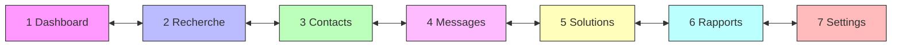
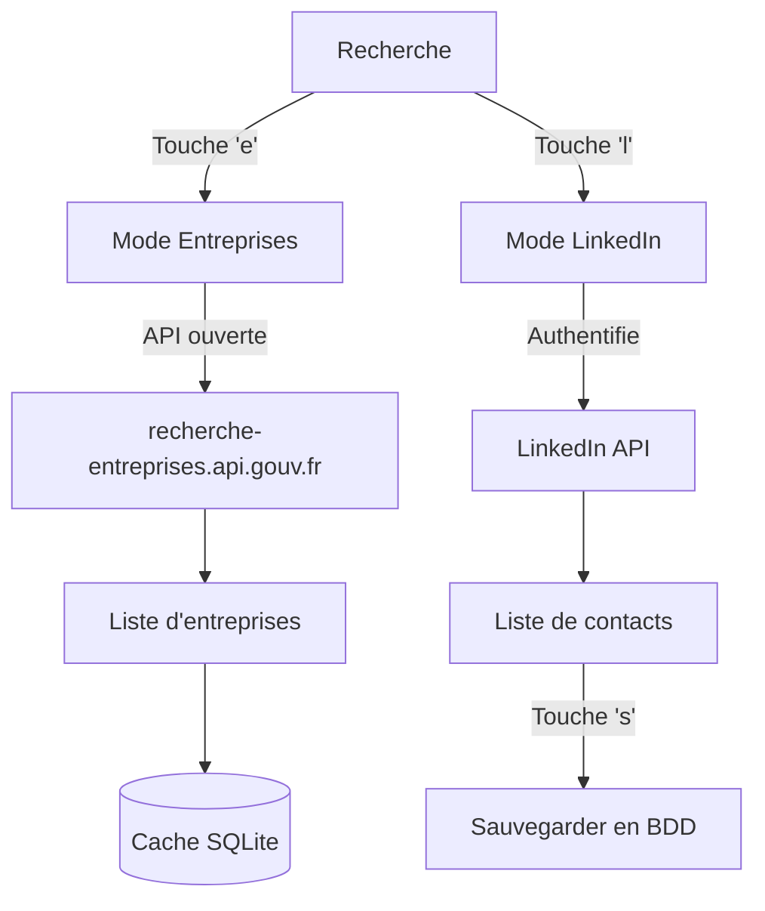
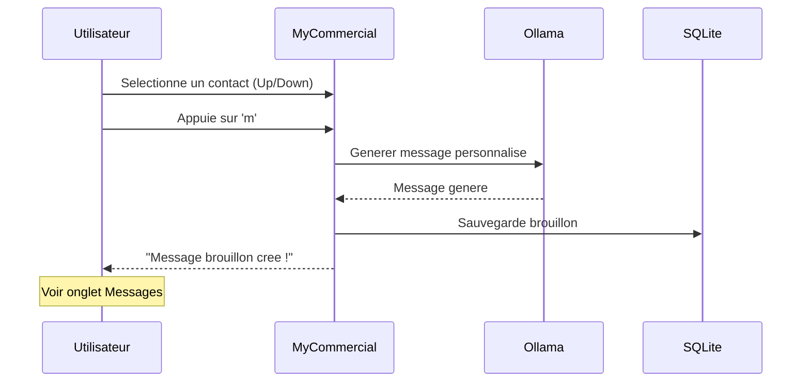
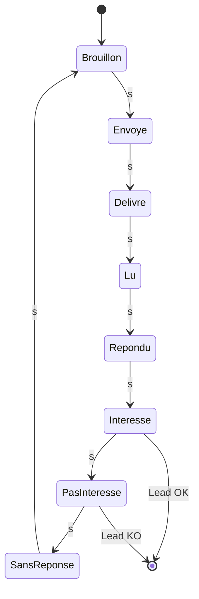
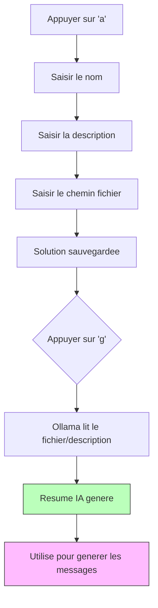
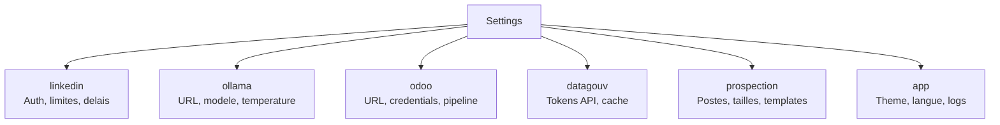
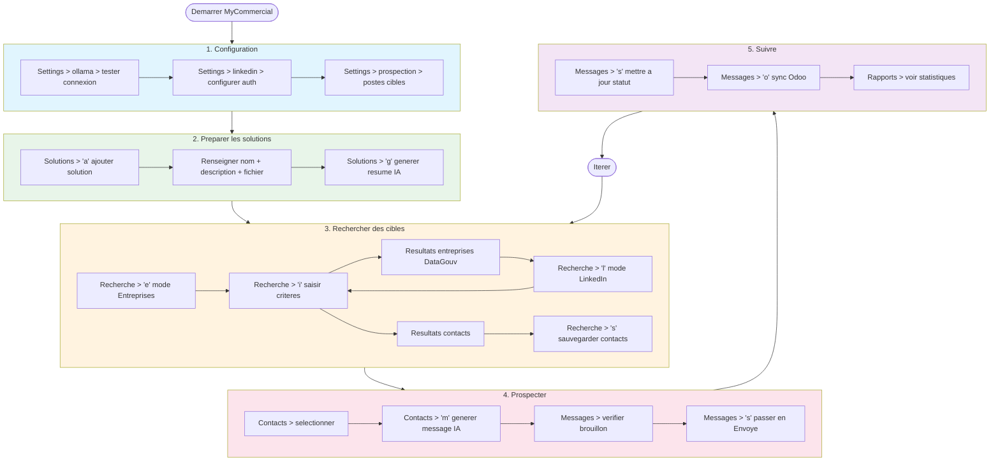

# MyCommercial - Guide d'Utilisation

## Table des matieres

- [Demarrage](#demarrage)
- [Navigation generale](#navigation-generale)
- [Dashboard](#1-dashboard)
- [Recherche](#2-recherche)
- [Contacts](#3-contacts)
- [Messages](#4-messages)
- [Solutions](#5-solutions)
- [Rapports](#6-rapports)
- [Settings](#7-settings)
- [Workflow complet](#workflow-complet)
- [Raccourcis clavier](#raccourcis-clavier)

---

## Demarrage

```bash
mycommercial
```

L'application demarre sur le **Dashboard** avec 7 onglets navigables.

```
┌─ MyCommercial - Prospection LinkedIn ──────────────────────────────┐
│ 1 Dashboard  2 Recherche  3 Contacts  4 Messages  5 Solutions ... │
└────────────────────────────────────────────────────────────────────┘
```

---

## Navigation generale



| Touche | Action |
|--------|--------|
| `Tab` / `Shift+Tab` | Onglet suivant / precedent |
| `1` a `7` | Aller directement a l'onglet N |
| `F1` | Afficher l'aide complete |
| `q` | Quitter l'application |
| `Ctrl+C` | Quitter immediatement |
| `r` | Rafraichir les donnees (dans la plupart des onglets) |

---

## 1. Dashboard

Le Dashboard affiche une vue d'ensemble de votre activite de prospection.

```
┌─ Contacts ──┐┌─ Messages ──┐┌─ Interesses ┐┌─ Taux rep. ─┐
│     42      ││     128     ││      8      ││   12.5%     │
└─────────────┘└─────────────┘└─────────────┘└─────────────┘
┌─ Funnel de Prospection ──────────────────────────────────┐
│  ████████████████  Envoyes: 128                          │
│  ██████████████    Lus: 96                               │
│  ██████            Reponses: 24                          │
│  ████              Interesses: 8                         │
│  ██                KO: 16                                │
└──────────────────────────────────────────────────────────┘
┌─ Connexions ─────────────────────────────────────────────┐
│  LinkedIn: Connecte  |  Ollama: mistral  |  Odoo: Active │
└──────────────────────────────────────────────────────────┘
```

**Raccourcis :** `r` = rafraichir

---

## 2. Recherche

L'onglet Recherche permet de trouver des entreprises et des contacts.

### Modes de recherche



### Recherche d'entreprises (mode par defaut)

1. Appuyer sur `i` ou `/` pour ouvrir la saisie
2. Taper le nom de l'entreprise ou un mot-cle
3. Appuyer sur `Enter` pour valider
4. Les resultats s'affichent avec SIREN, nom, code APE, ville, effectifs

```
┌─ Recherche - Entreprises (API ouverte) ──────────────────┐
│ cybersecurite [Entreprises (API ouverte)]                │
└──────────────────────────────────────────────────────────┘
┌─ Entreprises DataGouv (25) ──────────────────────────────┐
│ SIREN     │ Nom                  │ APE    │ Ville  │ Eff │
│ 123456789 │ CyberProtect SAS     │ 62.01Z │ Paris  │ 22  │
│ 987654321 │ SecureNet France     │ 62.02A │ Lyon   │ 41  │
└──────────────────────────────────────────────────────────┘
```

### Recherche LinkedIn

1. Appuyer sur `l` pour basculer en mode LinkedIn
2. Appuyer sur `i`, taper la recherche, `Enter`
3. Les contacts LinkedIn apparaissent
4. Appuyer sur `s` pour sauvegarder un contact en base

### Raccourcis Recherche

| Touche | Action |
|--------|--------|
| `i` ou `/` | Saisir une recherche |
| `e` | Mode Entreprises (API ouverte) |
| `l` | Mode LinkedIn |
| `Enter` | Lancer la recherche |
| `s` | Sauvegarder le contact selectionne (mode LinkedIn) |
| `Up/Down` | Naviguer dans les resultats |

---

## 3. Contacts

Liste de tous les contacts sauvegardes en base de donnees.

```
┌─ Contacts (42) - naviguer | m=Message | d=Supprimer | Page 1 ──┐
│ Prenom  │ Nom       │ Poste        │ Entreprise      │ LinkedIn│
│ Jean    │ Dupont    │ CEO          │ CyberProtect    │ V       │
│ Marie   │ Martin    │ CTO          │ SecureNet       │ V       │
│ Pierre  │ Bernard   │ RSSI         │ DataShield      │ -       │
└─────────────────────────────────────────────────────────────────┘
```

### Actions sur les contacts



| Touche | Action |
|--------|--------|
| `Up/Down` | Naviguer dans la liste |
| `m` | Generer un message IA pour le contact selectionne |
| `d` | Supprimer le contact |
| `PageUp/PageDown` | Page precedente / suivante |
| `r` | Rafraichir |

---

## 4. Messages

Suivi de tous les messages de prospection envoyes.

### Cycle de statut



Appuyez sur `s` pour faire cycler le statut du message selectionne.

### Synchronisation Odoo

Appuyez sur `o` sur un message pour creer un **lead CRM** dans Odoo avec :
- Nom du contact et poste
- Entreprise
- Contenu du message
- Probabilite selon le statut (Interesse = 70%, Repondu = 30%, KO = 0%)

| Touche | Action |
|--------|--------|
| `Up/Down` | Naviguer |
| `s` | Changer le statut (cycle) |
| `o` | Synchroniser vers Odoo CRM |
| `r` | Rafraichir |

---

## 5. Solutions

Gestion des documents solutions a promouvoir aupres des contacts.

### Workflow Solutions



### Ajouter une solution

1. Appuyer sur `a`
2. Saisir le **nom** de la solution > `Enter`
3. Saisir la **description** > `Enter`
4. Saisir le **chemin du fichier** (ou laisser vide) > `Enter`

### Generer un resume IA

1. Selectionner une solution avec `Up/Down`
2. Appuyer sur `g`
3. Ollama lit le fichier ou la description
4. Le resume apparait dans le panneau de detail

```
┌─ Solutions ────────────┐┌─ Detail Solution ──────────────────────┐
│ > CyberShield Pro      ││ Nom: CyberShield Pro                  │
│   DataGuard Suite      ││                                       │
│   CloudArmor           ││ Description: Solution de cybersecurite│
│                        ││ complete pour PME et ETI...            │
│                        ││                                       │
│                        ││ Fichier: /docs/cybershield.pdf         │
│                        ││                                       │
│                        ││ Resume IA:                             │
│ a=Ajouter              ││ CyberShield Pro offre une protection  │
│ g=Resume IA            ││ zero-trust avec un ROI de 40% sur les │
│                        ││ couts de securite des PME.             │
└────────────────────────┘└────────────────────────────────────────┘
```

| Touche | Action |
|--------|--------|
| `Up/Down` | Naviguer dans la liste |
| `a` | Ajouter une nouvelle solution |
| `g` | Generer un resume IA (Ollama) |
| `r` | Rafraichir |

---

## 6. Rapports

Vue detaillee des statistiques de prospection avec funnel de conversion.

```
┌─ Statistiques detaillees ────────────────────────────────┐
│                                                          │
│  Total contacts:       42                                │
│  Messages envoyes:     128                               │
│  Messages lus:         96                                │
│  Reponses recues:      24                                │
│  Interesses:           8                                 │
│  Pas interesses (KO):  16                                │
│  Sans reponse (>7j):   32                                │
│                                                          │
│  Taux de reponse:      18.8%                             │
│  Taux d'interet:       33.3%                             │
└──────────────────────────────────────────────────────────┘
┌─ Funnel de conversion ───────────────────────────────────┐
│  ████████  Envoyes   ████  Lus   ██  Reponses  █  OK/KO │
└──────────────────────────────────────────────────────────┘
```

**Raccourcis :** `r` = rafraichir

---

## 7. Settings

Toutes les configurations sont stockees en base de donnees et editables depuis l'interface.

### Categories de settings



### Navigation Settings

```
┌─ Categories ─┐┌─ Settings [linkedin] ────────────────────────────┐
│ > linkedin   ││ Cle                │ Valeur       │ Description  │
│   ollama     ││ auth_method        │ oauth2       │ Methode auth │
│   odoo       ││ client_id          │              │ OAuth2 ID    │
│   datagouv   ││ client_secret      │ ********     │ OAuth2 Secret│
│   prospection││ access_token       │ ********     │ Token        │
│   app        ││ daily_limit        │ 50           │ Limite/jour  │
└──────────────┘└──────────────────────────────────────────────────┘
```

| Touche | Action |
|--------|--------|
| `Left/Right` | Changer de categorie |
| `Up/Down` | Naviguer dans les parametres |
| `Enter` ou `e` | Editer la valeur selectionnee |
| `Esc` | Annuler l'edition |
| `t` | Tester la connexion Ollama |
| `a` | Auto-selectionner le modele Ollama |
| `r` | Rafraichir |

### Settings importants

#### Prospection

| Cle | Valeur par defaut | Description |
|-----|-------------------|-------------|
| `postes_cibles` | CEO,CTO,RSSI,DSI,DG,PDG... | Postes a cibler |
| `tranches_effectifs` | 12,21,22,31,32,41 | Codes tranches INSEE |
| `message_template` | Bonjour {prenom}... | Template de message |

#### Ollama

| Cle | Valeur par defaut | Description |
|-----|-------------------|-------------|
| `base_url` | http://localhost:11434 | URL du serveur |
| `model` | (auto) | Modele selectionne |
| `auto_select` | true | Auto-selection du meilleur modele |
| `temperature` | 0.7 | Creativite (0.0 - 1.0) |
| `system_prompt` | Tu es un assistant commercial... | Prompt systeme |

---

## Workflow complet

Voici le workflow type d'une campagne de prospection :



### Etape par etape

1. **Configurer** : Renseigner les credentials (LinkedIn, Ollama, Odoo) dans Settings
2. **Solutions** : Ajouter vos solutions commerciales et generer les resumes IA
3. **Rechercher** : Trouver des entreprises cibles (DataGouv) puis des contacts (LinkedIn)
4. **Prospecter** : Generer des messages personnalises par l'IA et les envoyer
5. **Suivre** : Mettre a jour les statuts, synchroniser avec Odoo, analyser les rapports

---

## Raccourcis clavier

### Globaux

| Touche | Action |
|--------|--------|
| `Tab` / `Shift+Tab` | Onglet suivant / precedent |
| `1` - `7` | Aller a l'onglet N |
| `F1` | Aide |
| `q` | Quitter |
| `Ctrl+C` | Quitter immediatement |
| `r` | Rafraichir |
| `Esc` | Fermer popup / annuler edition |
| `Enter` | Valider saisie / editer |

### Par onglet

| Onglet | Touches | Actions |
|--------|---------|---------|
| Recherche | `i` `/` `e` `l` `s` | Saisir, Entreprises, LinkedIn, Sauvegarder |
| Contacts | `m` `d` `PgUp` `PgDn` | Message IA, Supprimer, Pagination |
| Messages | `s` `o` | Cycler statut, Sync Odoo |
| Solutions | `a` `g` | Ajouter, Resume IA |
| Settings | `e` `t` `a` `Left` `Right` | Editer, Test Ollama, Auto-select, Categorie |

---

## Codes des tranches d'effectifs INSEE

Utilises dans Settings > prospection > `tranches_effectifs` :

| Code | Tranche |
|------|---------|
| 00 | 0 salarie |
| 01 | 1-2 salaries |
| 02 | 3-5 salaries |
| 03 | 6-9 salaries |
| 11 | 10-19 salaries |
| 12 | 20-49 salaries |
| 21 | 50-99 salaries |
| 22 | 100-199 salaries |
| 31 | 200-249 salaries |
| 32 | 250-499 salaries |
| 41 | 500-999 salaries |
| 42 | 1000-1999 salaries |
| 51 | 2000-4999 salaries |
| 52 | 5000-9999 salaries |
| 53 | 10000+ salaries |
